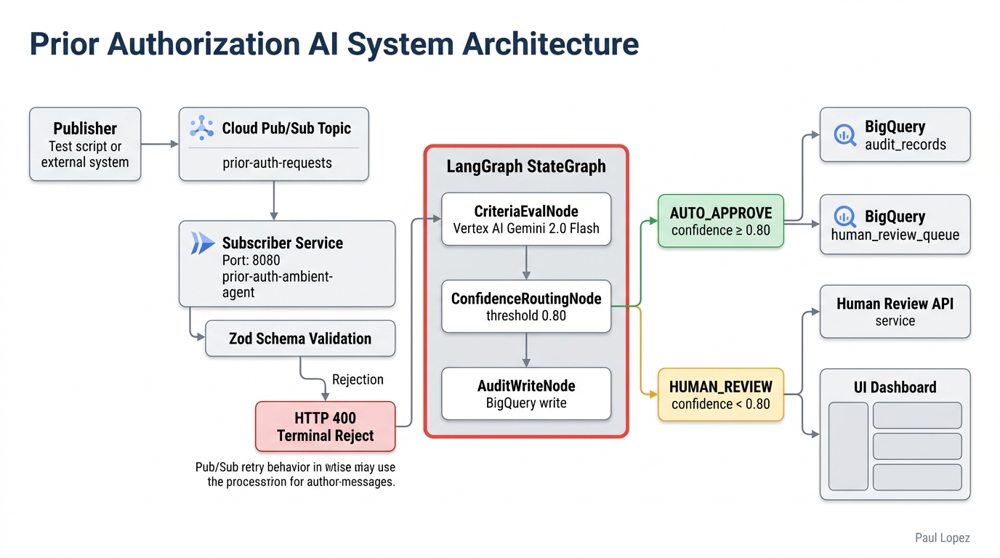

# prior-auth-ambient-agent

## Professional Context and IP Notice

This prototype is a reference design built to demonstrate the type of work I do as an AI architect in healthcare and enterprise contexts. It does not contain proprietary information, client data, trade secrets, internal systems knowledge, or confidential materials from any current or former employer or their clients. All data is synthetic, all architecture patterns are based on publicly available technologies and standards, and all code was written independently on personal equipment outside of employment obligations.

The scenarios and domain context (prior authorization, denial management, payer operations) reflect publicly understood healthcare industry problems, not any specific client engagement or internal system.

---

An always-on, event-triggered prior authorization agent on GCP.
No user invokes it. A Pub/Sub message arrives, the agent wakes,
evaluates the request, routes the determination, writes an audit
record to BigQuery, and returns to listening.

The existing prior auth portfolio covers user-invoked pipelines
([payer-auth-intelligence](https://github.com/paullopez-ai/payer-auth-intelligence)) and agent-to-agent negotiation
([auth-a2a-agent-network](https://github.com/paullopez-ai/auth-a2a-agent-network)). This prototype adds the third activation
pattern: **ambient event-driven**. A Pub/Sub topic receives prior auth
requests from upstream systems. A Cloud Run subscriber processes
each event through a three-node LangGraph pipeline backed by Vertex
AI Gemini. Requests above the confidence threshold are auto-approved.
Requests below it route to a human review queue. Every event produces
a BigQuery audit record with confidence, rationale, model version,
and cost.

**Demo Track:** Pub/Sub emulator + `MOCK_LLM=true` + `MOCK_BQ=true` (zero GCP calls)
**Live Demo Track:** Real GCP: Pub/Sub, Cloud Run, Vertex AI Gemini, BigQuery
**Related Repos:** [payer-auth-intelligence](https://github.com/paullopez-ai/payer-auth-intelligence) · [auth-a2a-agent-network](https://github.com/paullopez-ai/auth-a2a-agent-network)

---

## Architecture

```
GCP PROJECT: prior-auth-ambient-agent

  Publisher (test script or external system)
       |
       | publishes PriorAuthRequestMessage
       ▼
  Cloud Pub/Sub Topic
  [prior-auth-requests]
       |
       | push subscription (HTTPS POST)
       ▼
  Cloud Run: Subscriber Service        (port 8080)
  [prior-auth-ambient-agent]
       |
       | instantiates per message
       ▼
  LangGraph Pipeline (TypeScript, in-process)
  ┌──────────────────────────────────────────┐
  │  CriteriaEvalNode                        │
  │    → calls Vertex AI Gemini              │
  │    → evaluates against embedded criteria │
  │    → produces score + rationale          │
  │                  |                       │
  │  ConfidenceRoutingNode                   │
  │    → confidence >= 0.80 → AUTO_APPROVE   │
  │    → confidence < 0.80  → HUMAN_REVIEW   │
  │                  |                       │
  │  AuditWriteNode                          │
  │    → writes AuditRecord to BigQuery      │
  │    → if HUMAN_REVIEW: writes to          │
  │      HumanReviewQueue table              │
  └──────────────────────────────────────────┘
       |                          |
       ▼                          ▼
  BigQuery Dataset               BigQuery Dataset
  [audit_records]                [human_review_queue]

  Cloud Run: Human Review API  (port 8081)
  [prior-auth-review-api]
    GET  /review-queue
    POST /review-queue/:id/decision
    GET  /audit
    GET  /health
       |
       ▼
  UI: prior-auth-ambient-agent-ui
  (Next.js, bootstrapped, Cloud Run or local)
    /          → Agent Dashboard + event publisher
    /queue     → Human Review Queue
    /audit     → BigQuery Audit Trail
```



The subscriber service is the ambient activation layer. It is always
listening. When a Pub/Sub push arrives, it validates the message schema,
instantiates a fresh LangGraph pipeline, and processes the event. The
pipeline runs three nodes in sequence: **CriteriaEvalNode** calls Vertex AI
Gemini with the clinical request and a structured output schema;
**ConfidenceRoutingNode** applies the 0.80 threshold and assigns the
determination tier; **AuditWriteNode** writes the full audit record to
BigQuery regardless of outcome. If the determination is `HUMAN_REVIEW`,
a second record goes to the review queue table. The subscriber then
returns HTTP 200 to Pub/Sub and resumes listening.

---

## Demonstrated Capabilities

### Specification Precision

> *From the Architect:* An ambient agent that processes events without
> user oversight has no natural checkpoint where a human can catch a
> malformed input or an unexpected output before it reaches the audit
> log. I solved this with contracts at both ends. The Pub/Sub message
> is validated against a versioned Zod schema before the pipeline is
> instantiated. Invalid messages return HTTP 400 and are not retried.
> The Gemini system prompt specifies the exact JSON output schema so the
> model produces a parseable structured response, not free text requiring
> parsing. The TypeScript interfaces for every node output are keyed to
> the BigQuery schema, so a field mismatch is a compile error, not a
> runtime surprise.

**Key implementation:** [`src/contracts/prior-auth-request.ts`](src/contracts/prior-auth-request.ts) — versioned Zod schema; [`src/pipeline/nodes/criteria-eval.ts`](src/pipeline/nodes/criteria-eval.ts) — structured output prompt

### Evaluation and Quality Judgment

> *From the Architect:* The confidence threshold is the quality gate.
> Every determination below 0.80 is withheld from automatic processing
> and queued for human review. I did not pick 0.80 arbitrarily: it
> matches the threshold used in payer-auth-intelligence so the portfolio
> tells a consistent story about where the autonomous/supervised
> boundary sits. Five golden scenario tests verify the routing logic with
> deterministic mock responses before any live GCP call is made. The
> BigQuery audit table surfaces the confidence distribution across all
> processed events so the threshold can be evaluated against real
> workload patterns after live deployment.

**Key implementation:** [`src/pipeline/nodes/confidence-routing.ts`](src/pipeline/nodes/confidence-routing.ts) — threshold routing; [`tests/scenarios/`](tests/scenarios/) — five golden scenario tests

### Task Decomposition and Multi-Agent Orchestration

> *From the Architect:* I kept the pipeline to three nodes deliberately.
> Each node has one external dependency: CriteriaEvalNode calls Gemini,
> ConfidenceRoutingNode has no external calls, AuditWriteNode calls
> BigQuery. A Gemini timeout does not retry the BigQuery write. A
> BigQuery failure does not repeat the Gemini call. The subscriber
> instantiates a fresh pipeline per message so no state leaks between
> concurrent events. The full four-node pattern with interrupt is in
> payer-auth-intelligence; this prototype focuses the LangGraph work on
> the ambient activation context.

**Key implementation:** [`src/pipeline/graph.ts`](src/pipeline/graph.ts) — three-node StateGraph; [`src/subscriber/server.ts`](src/subscriber/server.ts) — per-message instantiation

### Trust and Security Design

> *From the Architect:* The IAM configuration is the trust boundary
> documentation. The Cloud Run service account has exactly two
> permissions: subscribe to the Pub/Sub topic and write to BigQuery.
> I wrote the Terraform IAM bindings before writing the pipeline code
> so the constraint existed before the system was deployable. Every
> determination below the confidence threshold writes to the human
> review queue and stops. It does not produce an automated outcome.
> Every audit record includes the message ID, model version, confidence
> score, and processing timestamp so every determination is fully
> attributable.

**Key implementation:** [`infra/terraform/iam.tf`](infra/terraform/iam.tf) — least-privilege service account; [`src/pipeline/nodes/audit-write.ts`](src/pipeline/nodes/audit-write.ts) — full audit trail per event

---

## Demo Track Setup

Zero GCP calls — runs entirely locally with emulator and mock fixtures.

```bash
# Clone and install
git clone https://github.com/paullopez-ai/prior-auth-ambient-agent
cd prior-auth-ambient-agent
bun install

# Start Pub/Sub emulator (Terminal 1)
gcloud beta emulators pubsub start --project=demo-project

# Setup emulator topic and subscription (Terminal 2, run once)
PUBSUB_EMULATOR_HOST=localhost:8085 bun run scripts/setup-emulator.ts

# Start subscriber service (Terminal 2)
MOCK_LLM=true MOCK_BQ=true \
PUBSUB_EMULATOR_HOST=localhost:8085 \
PUBSUB_PROJECT_ID=demo-project \
bun run src/subscriber/server.ts
# Subscriber running at http://localhost:8080

# Start human review API (Terminal 3)
MOCK_BQ=true bun run src/review-api/server.ts
# Review API running at http://localhost:8081

# Publish Scenario 2 (Terminal 4)
PUBSUB_EMULATOR_HOST=localhost:8085 \
PUBSUB_PROJECT_ID=demo-project \
bun run scripts/publish-scenario.ts --scenario scenario-2-human-review
# Expected: subscriber logs pipeline run, confidence 0.67, HUMAN_REVIEW routed
# Expected: data/mock-audit-log.jsonl has one new entry
# Expected: review queue has one pending item

# Start UI (Terminal 5)
cd ~/MyNewSoftware/prior-auth-ambient-agent-ui
bun dev
# UI at http://localhost:3000

# Run the test suite (any terminal, demo track)
bun run test
# Expected: 48 tests pass
```

---

## Live Demo Track Setup

Requires a GCP project with billing enabled. Uses OpenTofu (drop-in Terraform replacement).
All infrastructure is provisioned by Terraform — the GCP Console is never required.

### 1. Prerequisites

```bash
# Install gcloud CLI if not present: https://cloud.google.com/sdk/docs/install
# Install OpenTofu: brew install opentofu
# Install Docker Desktop
```

### 2. Create a GCP project

```bash
gcloud projects create YOUR_PROJECT_ID --name="Prior Auth Ambient Agent"

# List your billing accounts
gcloud billing accounts list

# Link billing (required for Cloud Run, BigQuery, Vertex AI)
gcloud billing projects link YOUR_PROJECT_ID --billing-account=YOUR_BILLING_ACCOUNT_ID
```

### 3. Authenticate

Terraform uses Application Default Credentials (ADC). If your machine opens the wrong
browser or the wrong Google account, use `--no-browser` to get a URL you can paste
into the correct browser manually:

```bash
# Standard path (opens your default browser)
gcloud auth application-default login

# If the wrong browser or account opens, use this instead:
gcloud auth application-default login --no-browser
# Follow the printed instructions: run the displayed command in a browser tab,
# then paste the output back into the terminal.
```

Credentials are saved to `~/.config/gcloud/application_default_credentials.json`.

Set your active project:

```bash
gcloud config set project YOUR_PROJECT_ID
```

### 4. Build Docker images

```bash
docker build -t subscriber -f docker/Dockerfile.subscriber .
docker build -t review-api -f docker/Dockerfile.review-api .
```

### 5. Provision infrastructure with OpenTofu

```bash
cd infra/terraform
tofu init

tofu plan \
  -var="project_id=YOUR_PROJECT_ID" \
  -var="subscriber_image=us-central1-docker.pkg.dev/YOUR_PROJECT_ID/prior-auth/subscriber:latest" \
  -var="review_api_image=us-central1-docker.pkg.dev/YOUR_PROJECT_ID/prior-auth/review-api:latest" \
  -out tfplan

tofu apply "tfplan"
```

`tofu apply` enables all required GCP APIs, creates service accounts, BigQuery dataset
and tables, Pub/Sub topic, and Artifact Registry. The Cloud Run services will fail on
first apply because the images are not yet pushed — that is expected. Continue to step 6.

### 6. Push images to Artifact Registry

```bash
# Configure Docker to authenticate against Artifact Registry
gcloud auth configure-docker us-central1-docker.pkg.dev

docker tag subscriber us-central1-docker.pkg.dev/YOUR_PROJECT_ID/prior-auth/subscriber:latest
docker push us-central1-docker.pkg.dev/YOUR_PROJECT_ID/prior-auth/subscriber:latest

docker tag review-api us-central1-docker.pkg.dev/YOUR_PROJECT_ID/prior-auth/review-api:latest
docker push us-central1-docker.pkg.dev/YOUR_PROJECT_ID/prior-auth/review-api:latest
```

### 7. Re-apply to deploy Cloud Run services

```bash
cd infra/terraform
tofu apply \
  -var="project_id=YOUR_PROJECT_ID" \
  -var="subscriber_image=us-central1-docker.pkg.dev/YOUR_PROJECT_ID/prior-auth/subscriber:latest" \
  -var="review_api_image=us-central1-docker.pkg.dev/YOUR_PROJECT_ID/prior-auth/review-api:latest"
```

Outputs include `subscriber_url` and `review_api_url`.

### 8. Publish a scenario against live GCP

```bash
GCP_PROJECT_ID=YOUR_PROJECT_ID \
bun run scripts/publish-scenario.ts --scenario scenario-2-human-review --live
# Expected: Cloud Run subscriber processes event, BigQuery audit record appears
```

**Cost guardrails:** Both Cloud Run services are configured with `min-instances=0`
(scale to zero). No traffic = no charge. Set a $20/month GCP billing alert.
BigQuery and Pub/Sub are effectively free at demo volume. Run `tofu destroy` to
tear down all resources when done (you will need to disable `deletion_protection`
on the BigQuery tables first).

---

## Design Decisions

**Push subscription over pull subscription**
Pub/Sub push delivers messages directly to the Cloud Run HTTP endpoint. Cloud Run
scales to zero between messages and scales up on demand. Pull would require a
long-running polling loop. Push + Cloud Run is the correct pattern for event-triggered,
cost-efficient ambient activation. Trade-off: the subscriber must respond HTTP 200
quickly and process async; errors must return 500 so Pub/Sub retries.

**Three nodes, not four**
`payer-auth-intelligence` has four nodes and a HumanReviewNode interrupt. This
prototype keeps three nodes because the interrupt pattern is already demonstrated.
The new work here is the ambient activation layer, not the pipeline internals.

**Gemini 2.0 Flash, not Gemini Ultra**
Prior auth determination is a structured classification task with a defined schema.
Flash is cost-optimized for exactly this use case; Ultra adds latency and cost with
no quality benefit for a constrained output schema.

**BigQuery over Cloud SQL or Firestore for audit**
The audit trail is append-only, high-volume, and needs to be queryable by compliance
teams who already use BigQuery. Cloud SQL adds operational overhead; Firestore is
document-oriented and not analytics-native.

**Separate Human Review API on its own Cloud Run service**
The subscriber service should only receive Pub/Sub events. A separate HTTP API
for the human review UI keeps the two concerns isolated. They share BigQuery but
nothing else.

---

## Repo Structure

```
prior-auth-ambient-agent/
├── src/
│   ├── contracts/
│   │   ├── prior-auth-request.ts    # Zod PriorAuthRequestMessage v1.0
│   │   ├── audit-record.ts          # AuditRecord + HumanReviewQueueRecord types
│   │   └── review-queue-record.ts   # ReviewDecision types
│   ├── pipeline/
│   │   ├── graph.ts                 # LangGraph StateGraph (3 nodes)
│   │   ├── state.ts                 # PriorAuthState type
│   │   └── nodes/
│   │       ├── criteria-eval.ts     # Vertex AI Gemini inference
│   │       ├── confidence-routing.ts # 0.80 threshold routing
│   │       └── audit-write.ts       # BigQuery write
│   ├── clients/
│   │   ├── vertex.ts                # Gemini client (MOCK_LLM flag)
│   │   └── bigquery.ts              # BigQuery client (MOCK_BQ flag)
│   ├── subscriber/server.ts         # Pub/Sub push subscriber (port 8080)
│   └── review-api/
│       ├── server.ts                # Human review API (port 8081)
│       └── routes/
│           ├── queue.ts             # GET/POST review queue
│           ├── audit.ts             # GET audit records
│           └── health.ts            # GET health
├── scripts/
│   ├── setup-emulator.ts            # Create topic + subscription in emulator
│   ├── publish-scenario.ts          # Publish a named scenario
│   └── publish-batch.ts             # Publish 10 messages (Scenario 4)
├── data/
│   ├── mock-responses.json          # Deterministic Gemini fixtures
│   └── scenarios.json               # Five scenario payloads
├── docs/
│   ├── architecture.mermaid         # System diagram (Mermaid graph TD)
│   └── interview-demo-guide.md      # 5-minute demo walkthrough
├── infra/terraform/                 # GCP infrastructure (Terraform)
├── docker/                          # Dockerfiles for Cloud Run
└── tests/
    ├── scenarios/                   # Five golden scenario tests
    ├── pipeline/                    # Node unit tests
    └── contracts/                   # Zod schema tests
```

---

## Interview Demo Guide

See [`docs/interview-demo-guide.md`](docs/interview-demo-guide.md) for the five-scenario
15-minute walkthrough script.

---

## Portfolio Context

This prototype extends the prior authorization narrative arc:

| Repo | Pattern | Cloud |
|------|---------|-------|
| `prior-auth-radar` | Provider-side denial risk detection | — |
| `payer-auth-intelligence` | User-invoked payer-side LangGraph pipeline | AWS |
| `auth-a2a-agent-network` | A2A inter-agent negotiation | — |
| `prior-auth-ambient-agent` | **Ambient event-triggered payer-side agent** | **GCP** |
| `prior-auth-ambient-agent-ui` | Next.js dashboard for the above (forthcoming) | **GCP** |

The arc covers user-invoked, agent-to-agent, and ambient activation patterns
across AWS and GCP. The framing: "I built the same prior authorization problem
three ways with three different activation patterns to understand the architectural
tradeoffs."
